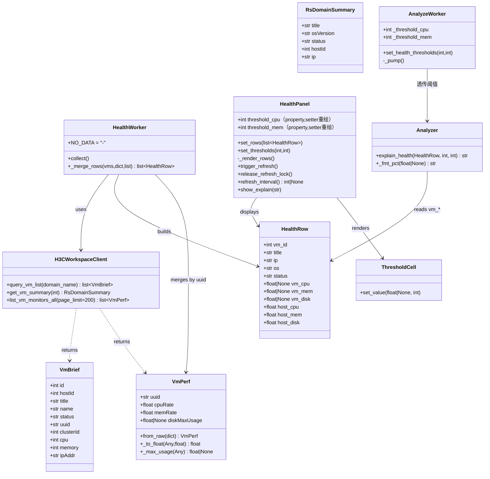
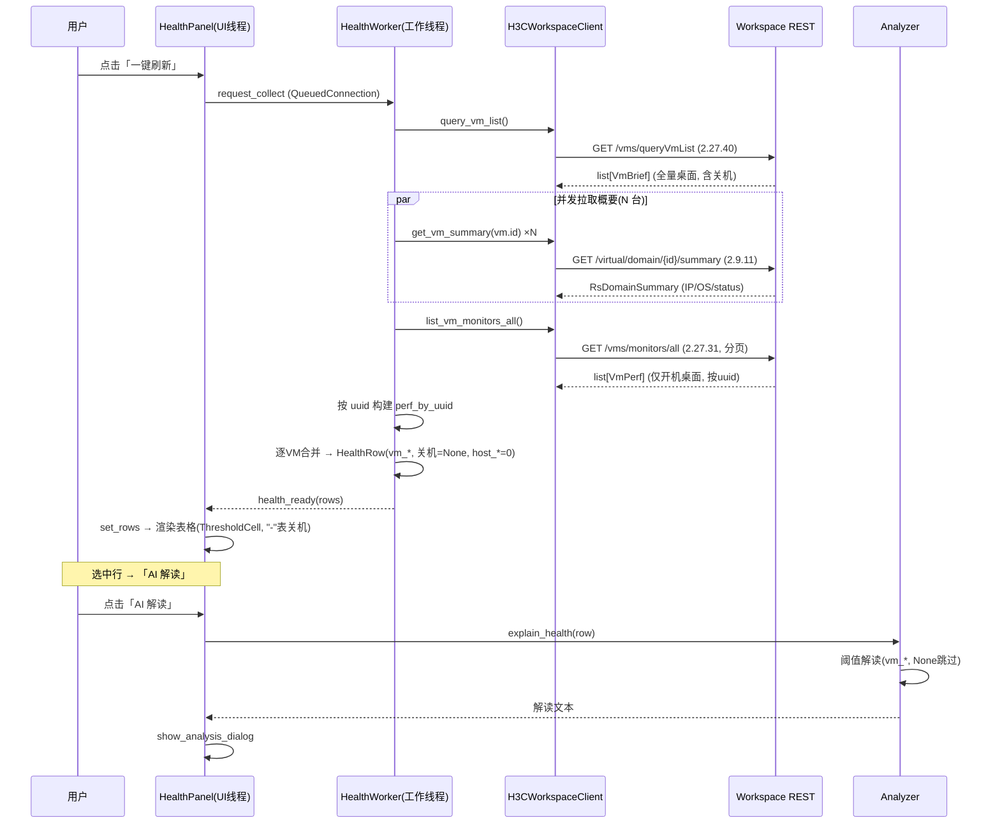
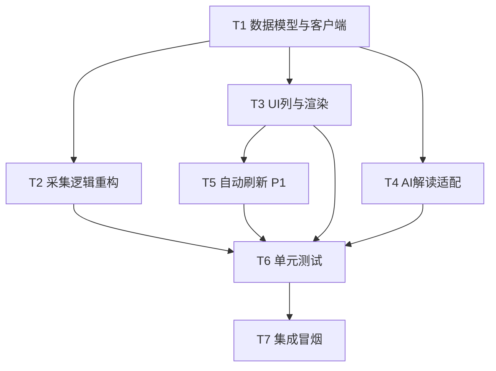

# 桌面健康监控（桌面级口径）增量增强 — 架构设计 + 任务分解

> 文档版本：v1.0.0-health-arch（**含实现回填：见 §10**）
> 架构师：高见远（software-architect）
> 实现：寇豆码（software-engineer）
> 关联 PRD：`PRD-health.md`（v1.0.0-health）
> 技术栈：Python 3.14 + PyQt5 + PyInstaller（Windows 桌面 EXE）
> 设计性质：**纯增量增强**（不重构既有架构，仅扩展模型/接口/采集/渲染）

> **阅读提示**：§0–§9 为架构师原始设计（保留原貌以便追溯），实现阶段主理人追加拍板的 3 项决策与最终签名统一回填在 **§10 实现落地回填**；字段/函数签名**以 §10 为准**。

---

## 0. 决策基线（主理人拍板，按此设计）

| 项 | 决策 |
|---|---|
| **性能口径** | **桌面级（per-VM）**：CPU/内存/磁盘利用率取单台虚拟机自身性能，贴合用户原话「桌面的 CPU/内存/磁盘利用率」 |
| **桌面清单 + IPv4** | `2.27.40 虚拟机列表`（响应 `ipAddr`）或 `2.9.11 虚拟机 summary`（`data.server.addresses[*].addr`）；**IPv4 兜底链：`addresses` → `vmIp` → `ipAddr`** |
| **性能批量** | `GET /vms/monitors/all`（`2.27.31`）→ `data[]`，含 `cpuRate`/`memRate`/`disk[].usage`（单位 %），**按 `uuid` 关联**；**仅返回开机桌面** |
| **宿主级 `2.4.12`** | 本次**不采用**，仅作备选说明；`host_*` 字段保留作对照兼容 |
| **关机桌面** | 在清单中保留行，CPU/内存/磁盘显示 **"-"**（性能接口不含关机桌面） |
| **磁盘利用率** | 取 `disk[].usage` 的**最大值聚合**（`max(usage)`）；实现阶段追加：`disk` 无可用 usage 时**兜底** `partition[].usage`，皆无 → `None`（见 §10.2） |
| **阈值着色** | 复用现有 **85%**（CPU/内存/磁盘越界红色加粗） |
| **刷新** | 沿用现有 `HealthWorker` 模式（手动刷新 + 跨线程排队 `Qt.QueuedConnection`），**可选**加定时自动刷新（10/30/60/120s，**默认关闭**，见 §10.4） |
| **阈值联动**（实现期拍板） | 阈值**单一来源**：`cfg.health.threshold_cpu/mem` 同时驱动 `HealthPanel` 着色与 `AnalyzeWorker → Analyzer.explain_health` 判定，配置保存后热更新（见 §10.3） |

**关联键说明**：PRD 统称「domainUuid」，实测 `2.27.31` 批量响应每项为 `data.uuid`（string，虚拟机 uuid），而 `2.27.40 query_vm_list` 的 `VmBrief.uuid` 与之同义，故以 **`uuid`（string）** 作为关联键。

> ⚠️ 本表「IPv4 兜底链 `addresses` → `vmIp` → `ipAddr`」为**设计期**表述；**实现期主理人拍板为两级**：`server.addresses` → `ipAddr`，**不调用 2.27.22 取 `vmIp`**，两级皆无显示 `-`。以 §10.1 为准。

---

## 1. 实现方案 + 框架选型

### 1.1 技术难点与选型

| 难点 | 方案 |
|---|---|
| 口径切换（宿主级 → 桌面级） | **纯增量**：不改 PyQt5 架构与信号/槽机制，仅扩展 `HealthRow` 字段、新增客户端方法、改写 `collect` 关联逻辑、调整渲染列。沿用 `BaseWorker` + `QThreadPool` + `Qt.QueuedConnection` 跨线程队列。 |
| 减少请求数（原 N 次宿主轮询） | 用 `2.27.31` 单次批量接口（分页）替代「逐 host 调 `2.4.12`」，请求数从 O(主机数) 降到 **1~2 次**；`2.9.11` 概要仍按桌面并发拉取（获取 IP/OS/status），保持既有并发模式。 |
| 关机桌面无性能 | 以「全量清单 `query_vm_list`」为行基准；性能 `map: uuid → VmPerf`；关联命中的填 `vm_*`，未命中的（关机）置 `None` → UI 显示 "-"。 |
| 阈值高亮兼容 None | 扩展 `ThresholdCell` 支持 `None`（显示 "-"、不红），向后兼容现有 `float` 调用。 |

### 1.2 框架与库

- **沿用**：`PyQt5`（UI/信号）、`PyQt5.QtCore.QThreadPool`/`QRunnable`（并发）、`dataclasses`（数据类）、`requests`（经 `DigestAuthHTTP` 封装，已在 `core/digest_auth.py`）。
- **新增依赖**：**无**。所有能力由既有代码扩展即可。

### 1.3 架构模式

维持既有 **Model-Worker-View** 分层：
- `core/models.py`：纯数据类（`HealthRow`/`VmPerf`/`VmBrief`/`RsDomainSummary`）。
- `core/workspace_client.py`：REST 客户端（新增 `list_vm_monitors_all`）。
- `workers/health_worker.py`：采集编排（`collect` 重写关联逻辑）。
- `ui/health_panel.py` + `ui/widgets.py`：视图与单元格渲染。
- `ai/analyzer.py`：AI 解读（改用 `vm_*` 口径）。

---

## 2. 文件列表（相对路径，标注改动类型）

| 文件路径 | 改动 | 说明 |
|---|---|---|
| `src/core/models.py` | **改** | `HealthRow` 新增 `vm_cpu/vm_mem/vm_disk`（`float \| None`，默认 `None`）；新增 `VmPerf`（`diskMaxUsage: float \| None`）+ `from_raw()` + `_to_float()` + `_max_usage()`；`VmBrief` 新增 `ipAddr`；`_clean_vm` 提取 `ipAddr` |
| `src/core/workspace_client.py` | **改** | 新增 `list_vm_monitors_all(page_limit=200)`（2.27.31，循环分页 + uuid 去重 + 翻页上限保护）；`_clean_vm` 提取 `ipAddr`；新增 `_MONITORS_PAGE_LIMIT` / `_MONITORS_MAX_PAGES`（`get_host_cpumemdisk` 2.4.12 方法保留未删，桌面级口径下不调用） |
| `src/workers/health_worker.py` | **改** | `collect()` 重写：清单→概要→批量性能→按 uuid 关联；新增纯函数 `_merge_rows(vms, summary_store, monitors)`（唯一合并逻辑源，便于单测）；模块常量 `NO_DATA = "-"`；**删除** `_HostTask` 与 2.4.12 调用 |
| `src/workers/analyze_worker.py` | **改**（实现期新增） | `__init__(analyzer, threshold_cpu=85, threshold_mem=85)`；新增 `set_health_thresholds()`；`_pump()` 把阈值透传给 `Analyzer.explain_health(row, cpu, mem)` |
| `src/ui/health_panel.py` | **改** | 表头「桌面CPU%/桌面内存%/桌面磁盘%」绑定 `vm_*`；`threshold_cpu/mem` 改为 **property**（setter 触发重绘）；新增 `set_thresholds(cpu, mem)` 与统一渲染路径 `_render_rows()`；自动刷新下拉（默认「关闭」）；`request_refresh` 信号 + `trigger_refresh()` 去重 + `release_refresh_lock()` |
| `src/ui/widgets.py` | **改** | `ThresholdCell.set_value` 支持 `value: float \| None`，`None` 显示 `-` 不着红（向后兼容 float） |
| `src/ai/analyzer.py` | **改** | `explain_health` 改用 `vm_*` 口径，文案「桌面」；`None` 跳过阈值判定；三项全 `None` → 「暂无性能数据」；新增 `_fmt_pct()` |
| `src/ui/main_window.py` | **改**（实现期新增） | `health_panel.request_refresh → health_worker.request_collect.emit`；`_create_workers()` 传阈值；`_on_config_saved()` 调 `set_thresholds()` + `set_health_thresholds()`；`_on_worker_error` 调 `release_refresh_lock()` |
| `tests/test_models.py` | **改** | 新增 `VmPerf.from_raw`、`HealthRow` 缺省/关机场景断言 |
| `tests/test_workspace_client.py` | **改** | 桩 `GET /vms/monitors/all` 验证分页聚合与 `uuid` 关联 |
| `tests/test_workers.py` | **改** | 验证 `collect` 输出 `vm_*` 填充、关机行 `None`、行数=清单数 |
| `tests/test_analyzer.py` | **改** | 验证 `explain_health` 桌面口径与 `None` 跳过 |
| `tests/test_ui_smoke.py` | **改** | 验证表头改名、`"-"` 渲染、AI 解读弹窗字段 |

> 注：无新增源文件，全部为既有文件增量改动；测试文件为既有 `tests/` 下扩展。

---

## 3. 数据结构与接口（类图 + 字段表）

### 3.1 类图（Mermaid classDiagram）



### 3.2 关键字段表

**`HealthRow`（扩展后）** — `src/core/models.py`

| 字段 | 类型 | 来源 | 说明 |
|---|---|---|---|
| `vm_id` | int | 2.27.40 | 桌面 id |
| `title` | str | 2.9.11 / 2.27.40 | 名称 |
| `ip` | str | 2.9.11 `server.addresses` → 兜底 2.27.40 `ipAddr` → `-` | IPv4（**两级**兜底，实现期拍板；不调用 2.27.22 `vmIp`） |
| `os` | str | 2.9.11 `osVersion` | 操作系统 |
| `status` | str | 2.9.11 / 2.27.40 | 状态 |
| **`vm_cpu`** | `float \| None` | **2.27.31 `cpuRate`** | 桌面 CPU%；关机=None |
| **`vm_mem`** | `float \| None` | **2.27.31 `memRate`** | 桌面内存%；关机=None |
| **`vm_disk`** | `float \| None` | **2.27.31 `max(disk[].usage)`**（兜底 `partition[].usage`） | 桌面磁盘%；关机/无数据=None |

> `vm_*` 默认值均为 **`None`**（不是 0.0）：`None` = 无数据（关机 / 接口未返回 / 磁盘无 usage），UI 显示 `-` 且不着红、AI 跳过该项阈值判定；`0.0` 才是真实的「利用率 0%」。两者语义不得混用。

**`VmPerf`（新增）** — `src/core/models.py`，对应 2.27.31 单条 DTO

| 字段 | 类型 | 默认值 | 来源 |
|---|---|---|---|
| `uuid` | str | `""` | `data.uuid`（关联键） |
| `cpuRate` | float | `0.0` | `data.cpuRate`（脏值回退 0.0） |
| `memRate` | float | `0.0` | `data.memRate`（脏值回退 0.0） |
| `diskMaxUsage` | **`float \| None`** | **`None`** | `max(disk[].usage)` → 兜底 `max(partition[].usage)` → 皆无 `None` |

**`VmBrief`（扩展）** — 新增 `ipAddr: str = ""`（`_clean_vm` 提取 `str(d.get("ipAddr","") or "")`）。
| `host_cpu` | float | （保留）2.4.12 | 宿主对照字段，桌面级口径下**不填充**（默认 0.0） |
| `host_mem` | float | （保留）2.4.12 | 同上 |
| `host_disk` | float | （保留）2.4.12 | 同上 |

**`VmPerf`（新增）** — `src/core/models.py`，对应 2.27.31 单条 DTO

| 字段 | 类型 | 来源 |
|---|---|---|
| `uuid` | str | `data.uuid`（关联键） |
| `cpuRate` | float | `data.cpuRate` |
| `memRate` | float | `data.memRate` |
| `diskMaxUsage` | float | `max(data.disk[].usage)` |

**`VmBrief`（扩展）** — 新增 `ipAddr: str = ""`（`_clean_vm` 提取 `str(d.get("ipAddr","") or "")`）。

### 3.3 客户端 / Worker / Panel 新增方法签名（最终实现）

```python
# src/core/workspace_client.py —— 2.27.31（桌面级性能，仅开机桌面）
def list_vm_monitors_all(self, *, page_limit: int = 200) -> list[VmPerf]:
    """GET /vms/monitors/all，按 limit/offset 循环分页拉全量。

    - total 已知：取满即止；total 缺失：以「短页」判定末页
    - 按 uuid 去重（分页边界重复不产生重复行）
    - 翻页上限保护 _MONITORS_MAX_PAGES=200（200*200=40000 台）
    - 任一页失败 → raise_if_fail 抛 WorkspaceAPIError（由 worker try/except 兜底）
    """

# src/core/models.py —— 磁盘聚合（主源 + 兜底）
@classmethod
def VmPerf._max_usage(cls, items) -> float | None:
    """只统计携带 usage 字段的条目取 max；数组空/全部无 usage → None。"""

# src/workers/health_worker.py —— 合并（唯一逻辑源，便于单测）
NO_DATA = "-"                      # IPv4 两级兜底皆无时的占位符

@staticmethod
def HealthWorker._merge_rows(vms, summary_store: dict, monitors) -> list[HealthRow]:
    """行数 = 清单数；未命中性能（关机）→ vm_* = None；ip = s.ip or vm.ipAddr or NO_DATA。"""

# src/workers/analyze_worker.py —— 阈值透传（与 HealthPanel 同源）
def __init__(self, analyzer, threshold_cpu: int = 85, threshold_mem: int = 85) -> None: ...
def set_health_thresholds(self, threshold_cpu: int, threshold_mem: int) -> None: ...
# _pump(): self.analyzer.explain_health(payload, self._threshold_cpu, self._threshold_mem)

# src/ui/health_panel.py —— 阈值 property + 统一渲染路径
@property
def threshold_cpu(self) -> int: ...          # setter 内部 → self._render_rows()
@threshold_cpu.setter
def threshold_cpu(self, value: int) -> None: ...

def set_thresholds(self, threshold_cpu: int, threshold_mem: int) -> None:
    """批量更新阈值，只重绘一次（配置热更新推荐入口）。"""

def _render_rows(self) -> None:
    """按当前阈值重绘；set_rows 与阈值变更共用（table 未建时直接返回）。"""

def set_rows(self, rows: list[HealthRow]) -> None:
    """存数据 → release_refresh_lock() → _render_rows() → 更新「最后刷新」。"""
```

> **统一渲染约定**：`set_rows()` 与阈值变更最终都汇流到 `_render_rows()`，因此**表格着色与 `Analyzer` 判定必然同源**。改阈值请走 `set_thresholds()` 或直接给 property 赋值，**不要**直接改 `self._threshold_*`（会绕过渲染）。
>
> 分页处理（原始设计）：循环 `offset += limit` 直至 `_extract_total(data) <= offset` 或返回空；实现改为「按服务端实际返回条数推进 offset」，避免单页上限 < `page_limit` 时跳页漏数据。

---

## 4. 程序调用流程（时序图 / 步骤）

### 4.1 时序图（Mermaid sequenceDiagram）



### 4.2 关键步骤（采集关联伪逻辑）

```
collect():
  1. vms = client.query_vm_list()                     # 2.27.40 全量（含关机）
  2. summary_store = 并发 get_vm_summary(vm.id)        # 2.9.11 IP/OS/status
  3. monitors = client.list_vm_monitors_all()          # 2.27.31 批量性能
  4. perf_by_uuid = { m.uuid: m for m in monitors }    # 关联键 uuid
  5. for vm in vms:
        s = summary_store.get(vm.id) or default
        p = perf_by_uuid.get(vm.uuid)                   # 关机→None
        rows.append(HealthRow(
            vm_id=vm.id, title=..., ip=s.ip or vm.ipAddr, os=s.osVersion, status=s.status,
            vm_cpu=p.cpuRate if p else None,
            vm_mem=p.memRate if p else None,
            vm_disk=p.diskMaxUsage if p else None,
            host_cpu=0.0, host_mem=0.0, host_disk=0.0,   # 桌面级不填充
        ))
  6. emit health_ready(rows)
```

---

## 5. 任务列表（有序、含依赖、按实现顺序）

> 优先级：P0=必须 / P1=建议(可选自动刷新) / P2=增强(AI 解读)

| 任务 | 名称 | 源文件 | 依赖 | 优先级 |
|---|---|---|---|---|
| **T1** | 数据模型与客户端扩展 | `src/core/models.py`、`src/core/workspace_client.py` | 无 | P0 |
| **T2** | 采集逻辑重构（collect 关联） | `src/workers/health_worker.py` | T1 | P0 |
| **T3** | UI 列与渲染重写 + ThresholdCell 支持 None | `src/ui/health_panel.py`、`src/ui/widgets.py` | T1 | P1 |
| **T4** | AI 解读适配（vm_* 口径） | `src/ai/analyzer.py`、`src/ui/health_panel.py` | T1 | P2 |
| **T5** | 自动刷新（30s 可选，P1） | `src/ui/health_panel.py` | T3 | P1 |
| **T6** | 单元测试扩展 | `tests/test_models.py`、`test_workspace_client.py`、`test_workers.py`、`test_analyzer.py`、`test_ui_smoke.py` | T1–T5 | P0 |
| **T7** | 集成冒烟（手工/脚本验证 60 行采集 + 着色） | 现有 `tests/test_ui_smoke.py` + 手工 | T1–T6 | P0 |

**各任务要点：**

- **T1**（`models.py`）：`HealthRow` 增 `vm_cpu/vm_mem/vm_disk: float|None=None`；新增 `VmPerf` + `VmPerf.from_raw`；`VmBrief` 增 `ipAddr`，`_clean_vm` 提取；`workspace_client.py` 增 `list_vm_monitors_all`（分页循环）；可选：`_extract_ip` 兜底 `vmIp`/`ipAddr`。
- **T2**（`health_worker.py`）：`collect()` 改为「清单 → 并发概要 → 批量性能 → 按 uuid 关联」；关机行 `vm_*` 置 `None`；行数 = 清单数（保留关机桌面行）。移除对 `get_host_cpumemdisk` 的依赖（桌面级口径）。
- **T3**（`health_panel.py` + `widgets.py`）：表头 `["名称","IP","操作系统","状态","桌面CPU%","桌面内存%","桌面磁盘%"]`；`set_rows` 用 `row.vm_cpu/vm_mem/vm_disk`，`None` → `ThresholdCell(None)` 显示 "-";`ThresholdCell.set_value` 入参改 `float | None`，`None` 时 `setText("-")` 且用 `THRESHOLD_NORMAL_STYLE`（不红）。
- **T4**（`analyzer.py`）：`explain_health` 改用 `vm_cpu/vm_mem/vm_disk`，文案由「宿主机」改「桌面」；对 `None` 跳过阈值判定（视为关机/无数据）；`health_panel.show_explain` 摘要同步 `vm_*`。
- **T5**（`health_panel.py`）：`QTimer` 30s 触发 `request_collect`（复用现有刷新链路），提供开关（建议默认**关闭**，待用户确认）；刷新中禁用重复触发沿用既有逻辑。
- **T6**（测试）：覆盖 `VmPerf.from_raw`、关机 `None`、分页聚合、`collect` 行数/字段、`explain_health` 桌面口径、UI 表头与 "-" 渲染。
- **T7**（冒烟）：运行确认采集约 60 行、开机桌面有 `vm_*` 数值、关机显示 "-"、≥85% 红色。

### 5.1 任务依赖图（Mermaid graph）



---

## 6. 依赖包列表

| 包 | 版本 | 用途 | 状态 |
|---|---|---|---|
| `PyQt5` | 既有 | UI / 信号 / 线程 | 不新增 |
| `requests` | 既有 | HTTP（经 `DigestAuthHTTP`） | 不新增 |
| `pytest` | 既有 | 单测 | 不新增 |

**结论：预计无新增第三方依赖。**

---

## 7. 共享知识（跨文件约定）

- **字段命名**：桌面级性能统一前缀 `vm_`（`vm_cpu`/`vm_mem`/`vm_disk`），与既有 `host_`（宿主级）区分；**不要用** `desktop_` 命名，避免与模块名冲突。
- **百分比单位**：`vm_cpu/vm_mem/vm_disk` 为 **已乘 100 的数值（%）**，如 `73.0` 表示 73%；界面用 `f"{v:.0f}%"` 显示整数；`None` 表示无数据（关机）。
- **关联键**：统一用 **`uuid`（string）** 关联 `VmBrief` 与 `VmPerf`；PRD 口中的「domainUuid」即 `data.uuid`。
- **阈值常量**：CPU/内存/磁盘统一 **85%**；`HealthPanel.__init__(threshold_cpu=85, threshold_mem=85)` 为单一入口，`ThresholdCell` 与 `Analyzer.explain_health` 均接收该阈值参数（保持一致，避免硬编码散落）。**建议**（非强制）：后续可抽到 `core/constants.py` 的 `THRESHOLD_CPU/MEM/DISK`，本次不强制新建。
- **关机语义**：清单全量保留行；性能仅开机桌面有；未命中 → `vm_*=None` → UI "-"，**不计入**过载预警（阈值判定对 `None` 跳过）。
- **磁盘聚合**：`max(disk[].usage)`；分区级 `partition[]` 本次不做。
- **异常兜底**：客户端 `raise_if_fail` 抛 `WorkspaceAPIError`；worker `collect` 顶层 `try/except` 经 `self.bridge(exc)` 上报，单条失败不影响整体（沿用既有 `_SummaryTask` 风格）。

---

## 8. 待明确事项（需用户/主理人最终拍板）

> 口径已按主理人决策落地，**未发现与 PRD 决策的硬冲突**。以下为落地前需确认的细节：

1. **自动刷新默认开关**（T5）：建议间隔 30s，但**默认开启还是关闭**？建议默认关闭、由用户在设置中开启，避免无谓请求。（P1，可后置）
2. **宿主级 `host_*` 字段是否保留**：决策说「保留对照可选」。建议**保留字段但 UI 不展示**（满足 PRD F2-H-05「同时携带」），未来若需双列对比可零成本启用。是否同意？
3. **IPv4 兜底深度**：实现上用「`2.9.11 server.addresses` 主 → `2.27.40 ipAddr` 兜底」即可覆盖绝大多数场景；`2.27.22 vmIp` 作为更深兜底是否本次一并实现，还是留作后续？（建议本次仅做到 `ipAddr` 兜底）
4. **分页上限 / 总桌面规模**：`list_vm_monitors_all` 默认 `page_limit=200` 并循环分页，请确认贵环境单批桌面规模是否 < 数千（影响是否需优化）。
5. **磁盘阈值是否独立**：决策已定「复用 85%」，与现有 `health_panel` 行为一致，无需独立阈值。（已定，列出备查）

---

## 9. 与 PRD/现有实现的差异点（预期影响，非冲突）

| 项 | 现状（v1.0.0） | 本次变更 |
|---|---|---|
| 性能口径 | 宿主级（2.4.12） | → 桌面级（2.27.31） |
| 表头「宿主CPU%」 | 硬编码 `host_cpu` | → 「桌面CPU%」绑定 `vm_cpu` |
| `collect` 请求数 | O(主机数) 次宿主轮询 | → 1~2 次批量 + N 次概要 |
| `HealthRow` | 仅 `host_*` | → 增 `vm_*`（host 保留对照） |
| 关机桌面 | 无专门处理 | → 保留行、性能显示 "-" |

> 以上均为决策预期内的合理变更，不构成与 PRD 决策的冲突。

---

*本文档所有接口路径、字段 key、类型/单位均实证于 `Workspace REST API文档（E2010）.docx` 与现有源码（`health_worker.py`/`health_panel.py`/`models.py`/`analyzer.py`/`workspace_client.py`），可直接据此进入实现。*
