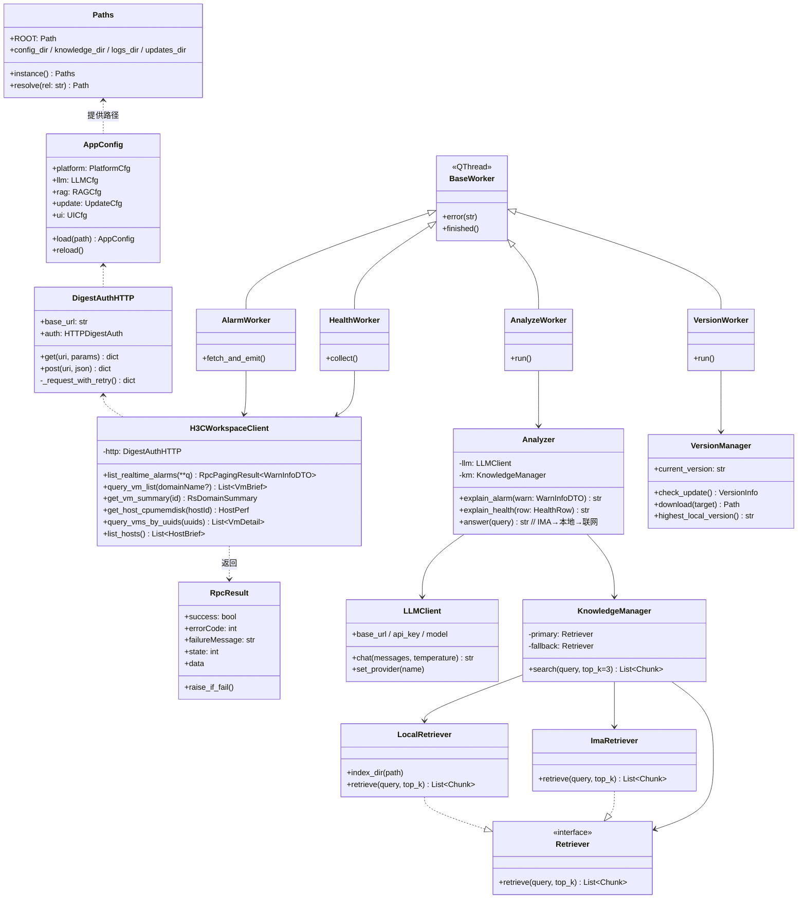
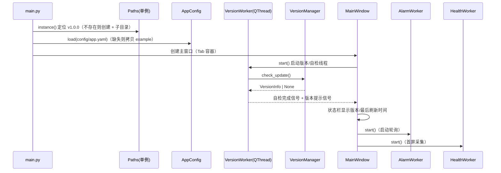
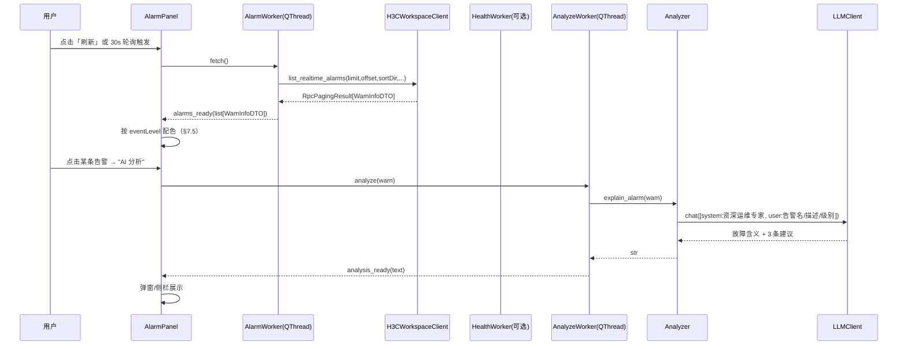
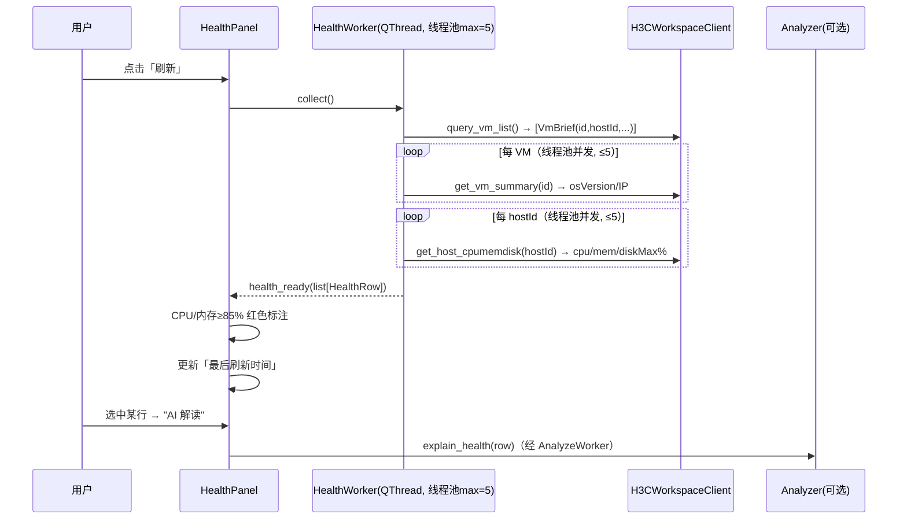
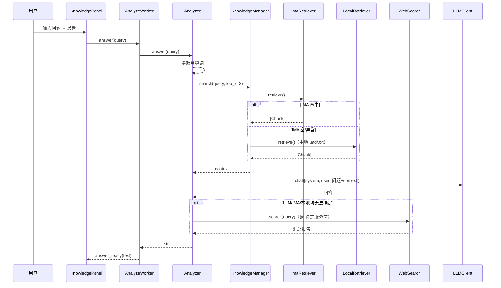

# H3C 云桌面智能运维助手 — 系统架构设计 v1.0.0

> 版本：v1.0.0 ｜ 作者：架构师 高见远（Gao） ｜ 状态：待工程师排期
> 形态：Python + PyQt5 桌面程序，PyInstaller 打包为单文件 Windows .exe
> 数据根目录：`C:\Users\liwanghao\Desktop\AI工具文件\v1.0.0\`

---

## 1. 实现方案与框架选型

### 1.1 总体形态
- **桌面单体应用**：PyQt5 提供 GUI，所有业务在本地进程内完成；无需后端服务。
- **打包形态**：PyInstaller `--onefile`，生成单个 `.exe`，双击即可在 Windows 运行（无需安装 Python 环境）。
- **运行目录约定**：exe 运行时以「数据根目录」为工作基准（见 §7.1 路径管理单例），不依赖 exe 自身所在路径，避免写入只读 Program Files。

### 1.2 选型与理由

| 关注点 | 选型 | 理由 |
|---|---|---|
| GUI 框架 | **PyQt5** | 跨平台成熟、信号槽机制天然适配异步回调、QThread 便于后台任务与 UI 解耦；满足 Windows 桌面 exe 诉求。 |
| 打包 | **PyInstaller** | 与 PyQt5 兼容好，支持 `--onefile` `--windowed`，社区资料多，可直接产出免环境 exe。 |
| HTTP 客户端 | **requests** | 自带 `HTTPDigestAuth`，覆盖 H3C 摘要认证；同步调用，配合 QThread 线程池使用，简单可控。 |
| LLM 接入 | **OpenAI 兼容 / httpx（可选）** | 走 `/v1/chat/completions`，base_url/api_key/model 全配置化；默认用 `openai` 官方 SDK（兼容任意 OpenAI 协议端点），亦可换 `httpx` 直接裸调。DeepSeek/GLM/通义 热插拔。 |
| RAG 检索 | **本地关键词/BM25（必选） + sentence-transformers（可选）** | 离线优先：必选路径用关键词/BM25 检索 `knowledge/` 下 .md/.txt，零外部依赖；可选路径加装轻量句向量提升召回，作为增强而非阻塞项。检索抽象为可替换适配层。 |
| IMA 知识库 | **ima 技能本地检索（适配层）** | 通过 IMA 提供的本地检索能力（CLI/进程调用/SDK）获取共享知识库内容，封装为 `ImaRetriever` 适配层；失败时回退本地知识库。 |
| 配置 | **PyYAML**（yaml） | 人易读、层级清晰，适合多组配置（平台/LLM/RAG/更新）。可选 toml，但 yaml 更通用。 |
| 并发 | **QThread + QThreadPool / 线程池（max=5）** | per-id / per-host 接口并发调用，避免阻塞 UI 主线程。 |
| 测试 | **pytest** | 对 core/ai 纯逻辑层做单元与契约测试，UI 层以手动验证为主。 |
| 日志 | 标准库 **logging** | 统一格式写入 `logs/`，无需额外依赖。 |

> 不引入重量级 Web 框架（FastAPI/Flask）、不引入数据库（SQLite 也可，但本期数据量小、均为即时查询，无需持久化），保持轻量桌面端定位。

---

## 2. 文件列表与目录树

```
C:\Users\liwanghao\Desktop\AI工具文件\
└── v1.0.0\                                  # 版本数据目录（启动时按版本号定位/创建）
    ├── ARCHITECTURE.md                      # 本文件
    ├── PRD.md                               # 产品需求文档
    ├── config\
    │   ├── app.yaml                         # 主配置（平台/LLM/RAG/更新/UI 全部配置项）
    │   └── app.yaml.example                 # 配置模板（首次启动若缺失则拷贝生成）
    ├── knowledge\                           # 本地知识库兜底（.md/.txt）
    │   ├── h3c_workspace_faq.md
    │   └── troubleshooting.txt
    ├── logs\                                # 运行日志（按日滚动）
    │   └── app_YYYYMMDD.log
    ├── updates\                             # 版本更新
    │   ├── version.json                     # 当前版本信息源（默认本地）
    │   └── v1.0.1\                          # 检测到的新版本下载目录（示例）
    │       └── ...
    └── src\                                 # 应用源码（打包进 exe）
        ├── main.py                          # 程序入口：自检→定位版本目录→加载配置→启动主窗口
        ├── core\
        │   ├── __init__.py
        │   ├── paths.py                     # 路径管理单例（§7.1）
        │   ├── config.py                    # 配置加载/校验/热重载（§7.2 schema）
        │   ├── logging_setup.py             # 日志初始化（§7.3）
        │   ├── digest_auth.py               # DigestAuthHTTP：摘要认证 + 失败重试（§7.6）
        │   ├── workspace_client.py          # H3CWorkspaceClient：封装 5 个 REST 接口
        │   ├── models.py                    # 数据结构/数据类（告警、桌面、主机性能等）
        │   └── errors.py                    # 异常定义 + 错误码映射（§7.4）
        ├── ai\
        │   ├── __init__.py
        │   ├── llm_client.py                # LLMClient：OpenAI 兼容调用，厂商热插拔
        │   ├── retriever_base.py            # Retriever 抽象基类（适配层接口）
        │   ├── local_retriever.py           # LocalRetriever：关键词/BM25 + 可选句向量
        │   ├── ima_retriever.py             # ImaRetriever：IMA 本地检索（§8 待明确契约）
        │   ├── knowledge_manager.py         # 检索策略编排：IMA→本地回退，top-k=3
        │   ├── analyzer.py                  # Analyzer：告警分析 / 健康解读 / RAG 问答
        │   └── web_search.py                # 联网搜索兜底（§8 待明确服务商）
        ├── update\
        │   ├── __init__.py
        │   └── version_manager.py           # VersionManager：版本检测/下载/目录识别
        ├── workers\
        │   ├── __init__.py
        │   ├── base_worker.py               # Worker 基类（信号定义、异常桥接）
        │   ├── alarm_worker.py              # 拉取+轮询实时告警（30s 默认）
        │   ├── health_worker.py             # 桌面健康并发采集（线程池 max=5）
        │   ├── analyze_worker.py            # 调用 LLM 做告警/健康/问答分析
        │   └── version_worker.py            # 启动自检 + 版本检查
        └── ui\
            ├── __init__.py
            ├── main_window.py               # 主窗口：Tab 容器 + 状态栏 + 菜单
            ├── alarm_panel.py               # 模块一 智能告警中心
            ├── health_panel.py              # 模块二 桌面健康监控
            ├── knowledge_panel.py           # 模块三 知识库与联网分析
            ├── update_panel.py              # 模块四 版本更新与软件库
            ├── config_dialog.py             # 配置编辑对话框（可视化改 yaml）
            ├── styles.py                    # 等级→颜色映射、QSS 主题（§7.5）
            └── widgets.py                   # 复用组件（状态标签、阈值单元格等）
```

> `src/` 全部随 exe 打包；`config/ knowledge/ logs/ updates/` 落在数据根目录（用户机器上的固定路径），与代码分离，便于用户维护知识库与配置。

---

## 3. 数据结构与接口（核心类）

### 3.1 类关系（Mermaid）



### 3.2 关键类方法签名

```python
# ---- core/digest_auth.py ----
class DigestAuthHTTP:
    def __init__(self, base_url: str, user: str, password: str,
                 timeout: float = 10.0, max_retries: int = 3)
    def get(self, uri: str, params: dict | None = None) -> dict
    def post(self, uri: str, json: dict | None = None) -> dict
    # 内部：401 重试、指数退避、超时控制；返回统一外层 dict（见 §7.4 错误码映射）

# ---- core/workspace_client.py ----
class H3CWorkspaceClient:
    def __init__(self, http: DigestAuthHTTP)
    def list_realtime_alarms(self, *, limit: int, offset: int,
                             sort_dir: int = 2, sort_field: str = "eventTime",
                             **filters) -> RpcPagingResult[WarnInfoDTO]
    def query_vm_list(self, domain_name: str | None = None) -> list[VmBrief]
    def get_vm_summary(self, vm_id: int) -> RsDomainSummary
    def get_host_cpumemdisk(self, host_id: int) -> HostPerf
    def query_vms_by_uuids(self, vm_uuids: list[str]) -> list[VmDetail]
    def list_hosts(self) -> list[HostBrief]

# ---- ai/llm_client.py ----
class LLMClient:
    def __init__(self, base_url: str, api_key: str, model: str,
                 timeout: float = 60.0)
    def chat(self, messages: list[dict], temperature: float = 0.3) -> str
    def set_provider(self, name: str)   # deepseek / glm / qwen ...

# ---- ai/retriever_base.py ----
class Retriever(ABC):
    @abstractmethod
    def retrieve(self, query: str, top_k: int = 3) -> list[Chunk]

# ---- ai/knowledge_manager.py ----
class KnowledgeManager:
    def __init__(self, primary: Retriever, fallback: Retriever)
    def search(self, query: str, top_k: int = 3) -> list[Chunk]
    # 先 primary(IMA)，为空或异常则 fallback(本地)

# ---- ai/analyzer.py ----
class Analyzer:
    def __init__(self, llm: LLMClient, km: KnowledgeManager,
                 web: WebSearch | None = None)
    def explain_alarm(self, warn: WarnInfoDTO) -> str
    def explain_health(self, row: HealthRow) -> str
    def answer(self, query: str) -> str   # RAG→联网兜底

# ---- update/version_manager.py ----
class VersionManager:
    def __init__(self, source: str, current: str)
    def check_update(self) -> VersionInfo | None
    def download(self, info: VersionInfo) -> Path
    def highest_local_version(self) -> str
```

### 3.3 核心数据类（core/models.py）

```python
@dataclass
class WarnInfoDTO:        # 2.12.1 实时告警
    id: int; eventName: str; eventDesc: str
    eventLevel: int        # 1紧急/2重要/3次要/4警告
    eventTime: int         # ms
    eventType: int         # 1主机/2虚拟机/3集群/4CPU/5内存/6虚拟化软件
    state: int             # 1确认/2未确认
    eventSrc: str; eventCount: int

@dataclass
class VmBrief:            # 2.27.40 虚拟机列表
    id: int; hostId: int; title: str; name: str
    status: str; uuid: str; clusterId: int; cpu: int; memory: int

@dataclass
class RsDomainSummary:    # 2.9.11 概要
    title: str; osVersion: str; status: str
    hostId: int; ip: str

@dataclass
class HostPerf:           # 2.4.12 主机性能
    cpuRate: float; memRate: float
    diskMaxUsage: float   # = max(disk[].usage)

@dataclass
class HealthRow:          # 模块二表格行聚合结果
    vm_id: int; title: str; ip: str; os: str; status: str
    host_cpu: float; host_mem: float; host_disk: float

@dataclass
class Chunk:              # 知识检索结果
    source: str; text: str; score: float
```

---

## 4. 程序调用流程（Mermaid 时序图）

### 4.1 启动自检 + 版本检查（模块四）


### 4.2 刷新告警 → AI 分析（模块一）


### 4.3 刷新健康监控（模块二）


### 4.4 RAG 问答（模块三）


---

## 5. 任务列表（交付工程师 寇豆码 排期，按实现顺序排列）

> 状态约定：每条含「任务名 / 涉及文件 / 依赖前置 / 验收点」。编号 T1..T18。

**阶段 A：基础设施（无 UI 依赖）**

- **T1 路径与配置骨架**
  - 文件：`core/paths.py`、`core/config.py`、`core/logging_setup.py`、`config/app.yaml.example`
  - 依赖：无
  - 验收：单测 `Paths.instance().knowledge_dir` 指向 `v1.0.0/knowledge`；`AppConfig.load` 能解析 example 并校验 schema；日志写入 `logs/`。

- **T2 异常与错误码映射**
  - 文件：`core/errors.py`
  - 依赖：T1
  - 验收：`RpcResult.raise_if_fail()` 在 `success=False` 或 `errorCode!=0` 时抛出带 `failureMessage` 的 `WorkspaceAPIError`；401 映射为 `AuthError`。

- **T3 摘要认证 HTTP 客户端**
  - 文件：`core/digest_auth.py`
  - 依赖：T1
  - 验收：`DigestAuthHTTP.get/post` 能带 `HTTPDigestAuth` 调用；401 触发指数退避重试（≤3 次）；超时受控；返回统一外层 dict。

- **T4 Workspace REST 客户端（5 接口）**
  - 文件：`core/workspace_client.py`、`core/models.py`
  - 依赖：T2, T3
  - 验收：对 5 个接口（2.12.1/2.27.40/2.9.11/2.4.12/2.27.39，含 2.4.7 主机列表）各写契约测试（用 mock HTTP 返回样例外层 JSON），数据类字段映射正确；`HostPerf.diskMaxUsage = max(disk[].usage)`。

**阶段 B：AI 与知识层**

- **T5 LLM 客户端（OpenAI 兼容）**
  - 文件：`ai/llm_client.py`
  - 依赖：T1
  - 验收：`chat()` 走 `/v1/chat/completions`；切换 `set_provider('deepseek'|'glm'|'qwen')` 仅改 base_url/model/api_key（来自配置）；超时处理。

- **T6 本地检索（关键词/BM25，可选句向量）**
  - 文件：`ai/retriever_base.py`、`ai/local_retriever.py`
  - 依赖：T1
  - 验收：`LocalRetriever.retrieve(query, top_k=3)` 从 `knowledge/` 读 .md/.txt 切块并返回带 score 的 Chunk；关键词模式零依赖；sentence-transformers 为可选 import（缺失不报错）。

- **T7 IMA 检索适配层（占位 + 回退）**
  - 文件：`ai/ima_retriever.py`
  - 依赖：T6
  - 验收：接口与 `Retriever` 一致；在契约未定前以「调用失败→空结果」实现，确保 `KnowledgeManager` 能安全回退；契约明确后补实现（见 §8）。

- **T8 知识管理与检索策略**
  - 文件：`ai/knowledge_manager.py`
  - 依赖：T6, T7
  - 验收：`search()` 先 IMA 后本地；top-k=3；IMA 异常/空自动回退本地；返回聚合 Chunk 列表。

- **T9 分析器（告警/健康/问答）**
  - 文件：`ai/analyzer.py`、`ai/web_search.py`（占位）
  - 依赖：T5, T8
  - 验收：`explain_alarm` 输出「含义+3 建议」；`explain_health` 给出阈值解读；`answer` 走 RAG→联网兜底链路（联网 API 待定，先留接口）。

**阶段 C：后台线程 Worker**

- **T10 Worker 基类**
  - 文件：`workers/base_worker.py`
  - 依赖：T2
  - 验收：统一 `error(str)` / `finished()` 信号；工作异常桥接到 `error` 而非崩溃。

- **T11 告警 Worker（轮询 30s）**
  - 文件：`workers/alarm_worker.py`
  - 依赖：T4, T10
  - 验收：`fetch()` 调 `list_realtime_alarms` 并 `alarms_ready` 信号；内置定时器，间隔可配（默认 30s，范围 10–300s）；首次立即拉取。

- **T12 健康 Worker（并发采集）**
  - 文件：`workers/health_worker.py`
  - 依赖：T4, T10
  - 验收：`collect()` 先 `query_vm_list` 拿全部 id+hostId，再用线程池（max=5）并发 `get_vm_summary`/`get_host_cpumemdisk`，聚合为 `HealthRow`；发出 `health_ready`。

- **T13 分析 Worker**
  - 文件：`workers/analyze_worker.py`
  - 依赖：T9, T10
  - 验收：封装 `Analyzer` 三方法，异步回调到对应 Panel；不阻塞 UI。

- **T14 版本 Worker（启动自检）**
  - 文件：`workers/version_worker.py`
  - 依赖：T15, T10
  - 验收：启动时跑自检（配置存在性、目录可写、平台连通性探活可选）+ `check_update`，发出 `selfcheck_done` / `update_available`。

**阶段 D：版本更新模块**

- **T15 版本管理器**
  - 文件：`update/version_manager.py`
  - 依赖：T1
  - 验收：`check_update()` 读 `updates/version.json` 或配置远程 URL，返回新版本信息；`download` 落地 `updates/v{新版本}/`；`highest_local_version()` 识别最高版本目录；checksum 可选（本期不强校验）。

**阶段 E：UI 层**

- **T16 主窗口 + 配置对话框 + 样式**
  - 文件：`ui/main_window.py`、`ui/config_dialog.py`、`ui/styles.py`、`ui/widgets.py`
  - 依赖：T1, T11..T14（信号对接）
  - 验收：Tab 容器含四模块；状态栏显示版本与最后刷新时间；配置对话框可改 yaml 并热重载；等级→颜色映射（§7.5）生效；菜单可触发自检/更新。

- **T17 四个功能面板**
  - 文件：`ui/alarm_panel.py`、`ui/health_panel.py`、`ui/knowledge_panel.py`、`ui/update_panel.py`
  - 依赖：T16, T11..T14
  - 验收：
    - 告警面板：等级配色、点击 AI 分析弹窗；
    - 健康面板：表格（名/IP/OS/状态/宿主CPU%/内存%/磁盘%），≥85% 红标，一键刷新+刷新时间；
    - 知识面板：问答入口，展示 RAG 来源与联网报告；
    - 更新面板：显示当前/最新版本，下载并提示重启。

- **T18 程序入口与打包**
  - 文件：`main.py`、`requirements.txt`、PyInstaller spec/命令
  - 依赖：T16, T17
  - 验收：`main.py` 流程=定位版本目录→加载配置→建主窗口→启动各 Worker；`pyinstaller --onefile --windowed` 产出 exe，双击运行，日志/知识库/配置读写正常。

---

## 6. 依赖包列表（requirements.txt）

```text
# ===== 运行时必须 =====
PyQt5>=5.15            # GUI 框架
requests>=2.31         # HTTP + 摘要认证
PyYAML>=6.0            # 配置解析
openai>=1.30           # OpenAI 兼容 LLM 调用（亦可用 httpx 替代）

# ===== 打包必须（开发/构建环境）=====
pyinstaller>=6.0       # 单文件 exe 打包

# ===== 测试 =====
pytest>=8.0            # 单元/契约测试

# ===== 可选（增强，缺失不阻塞运行）=====
numpy>=1.26            # 本地检索向量计算（BM25 关键词模式不需要）
sentence-transformers>=2.5   # 本地轻量句向量检索（可选 RAG 增强）
httpx>=0.27            # 若不用 openai SDK，可裸调 /v1/chat/completions（可选）
```

> 说明：`openai` 与 `httpx` 二选一即可（默认用 `openai`）。`numpy`/`sentence-transformers` 仅在使用向量模式检索时需要，安装体积较大，列为可选避免拖累基础安装。

---

## 7. 共享知识（跨文件约定）

### 7.1 路径管理单例（core/paths.py）
- 单例 `Paths.instance()`，进程内唯一。
- 根目录 `ROOT = C:\Users\liwanghao\Desktop\AI工具文件\v1.0.0`（可由环境变量 `H3C_OPS_ROOT` 覆盖，便于开发/测试）。
- 提供属性：`config_dir`、`knowledge_dir`、`logs_dir`、`updates_dir`，首次访问按需 `mkdir(parents=True, exist_ok=True)`。
- 所有文件读写**只经此单例**，禁止硬编码绝对路径。

### 7.2 配置 Schema（config/app.yaml）
```yaml
platform:
  base_url: "http://10.1.1.201:8083"
  user: "<外部接口认证用户-管理员>"
  password: "<password>"
  verify_ssl: false
llm:
  provider: "deepseek"          # deepseek / glm / qwen
  base_url: "https://api.deepseek.com/v1"
  api_key: "<key>"
  model: "deepseek-chat"
  temperature: 0.3
  timeout: 60
rag:
  top_k: 3
  use_vector: false              # true 需 sentence-transformers
  similarity_threshold: 0.3      # 仅向量模式生效
  ima_enabled: true
  ima_endpoint: ""               # §8 待明确
knowledge_dir: "knowledge"      # 相对 ROOT
health:
  alarm_refresh_sec: 30          # 10–300
  threshold_cpu: 85
  threshold_mem: 85
  max_concurrency: 5
update:
  source: "updates/version.json" # 或远程 URL
  remote_url: ""
  verify_checksum: false
ui:
  theme: "dark"
```
- `AppConfig` 启动时校验必填项（platform.base_url/user/password、llm.base_url/api_key/model），缺失则写入错误日志并弹窗提示。
- 配置变更经 `config_dialog` 保存后支持热重载（不重启即可生效的部分：LLM 厂商、刷新间隔、阈值）。

### 7.3 日志格式（core/logging_setup.py）
- 输出：`logs/app_YYYYMMDD.log` + 控制台；`RotatingFileHandler`（10MB/个，保留 5 个）。
- 格式：`%(asctime)s [%(levelname)s] [%(module)s.%(funcName)s] %(message)s`。
- 级别：默认 INFO；HTTP 请求/重试记 DEBUG；UI 异常记 ERROR 并上抛信号。

### 7.4 异常与错误码映射（core/errors.py）
- `WorkspaceAPIError(code, msg)`：来自外层 `errorCode`/`failureMessage`。
- 映射：`401 / success=False(认证)` → `AuthError`；网络超时/连接失败 → `NetworkError`；LLM 调用失败 → `LLMError`；检索失败 → `RetrievalError`。
- 所有 Worker 捕获后转 `error(str)` 信号，UI 以状态栏/弹窗提示，不崩溃。

### 7.5 事件等级 → 颜色映射（ui/styles.py）
| eventLevel | 含义 | 颜色（QColor） | 表格/标签 |
|---|---|---|---|
| 1 | 紧急 | 红 `#E53935` | 高亮底色 |
| 2 | 重要 | 橙 `#FB8C00` | 高亮底色 |
| 3 | 次要 | 黄 `#FDD835` | 浅底 |
| 4 | 警告 | 蓝灰 `#90A4AE` | 普通 |

- 健康监控阈值：`CPU/内存 ≥ threshold（默认 85）` → 单元格红色加粗；低于阈值正常色。
- 全局 QSS 主题集中在此文件，便于统一调整。

### 7.6 DigestAuth 失败重试策略（core/digest_auth.py）
- 使用 `requests.auth.HTTPDigestAuth`。
- 仅对**可重试错误**重试：`401`（重新握手摘要）、`5xx`、连接超时；`4xx`（非 401）直接抛 `WorkspaceAPIError` 不重试。
- 重试次数 `max_retries=3`，指数退避（0.5s → 1s → 2s）。
- 单请求 `timeout`（默认 10s，可配），不无限等待。

### 7.7 版本号读取来源（update/version_manager.py）
- 当前版本号：**代码内置常量 `APP_VERSION = "1.0.0"`**（与数据目录 `v1.0.0` 对应），同时 `updates/version.json` 可声明 `current_version` 用于校验。
- 新版本检测：读 `update.source`（默认本地 `updates/version.json`，字段 `latest_version`、`download_url`、`notes`）；若配 `remote_url` 则优先远程。
- 启动自动识别：扫描 `updates/v*` 目录取**语义版本最高**者作为可更新的本地缓存。

---

## 8. 待明确事项（需用户拍板 / 上线后验证，不含已决策项）

1. **IMA 本地检索的确切 IPC/CLI 契约**：`ImaRetriever` 通过何种方式调用 IMA（CLI 命令行？本地 HTTP？SDK？入参/出参 JSON schema？）。需 IMA 侧提供接口说明后补 T7 实现。当前已按「失败安全回退本地」设计，不影响其他模块推进。
2. **联网搜索服务商**：模块三兜底联网搜索用哪家（SerpAPI / Bing / DuckDuckGo / 自建代理？是否需 API key？）。T9 中 `WebSearch` 先留接口与占位实现。
3. **远端版本库地址**：`update.remote_url` 的上线地址、鉴权方式、`version.json` 字段规范（是否带 checksum）。本期默认用本地 `updates/version.json`，远程为可选增强。
4. **配置中敏感信息（platform.password / llm.api_key）是否加密落盘**：当前明文存 yaml。若需加密，需确认方案（系统凭据库 / 简单对称加密 / 启动输入）。
5. **健康监控的 osVersion / IP 默认走 per-id 2.9.11 的并发成本**：在桌面规模较大（数百+）时是否默认切换到 2.27.39 批量 UUID 查询。架构已预留 `query_vms_by_uuids` 作为可选优化路径，建议在联调时按实际规模决定默认策略。
6. **告警状态确认交互**：点击告警是否需调用「确认告警」写回平台（当前 PRD 未要求，仅展示+AI 分析）。若需，需补充对应 REST 接口与权限确认。
7. **离线向量模式可行性**：`sentence-transformers` 模型体积与首次加载耗时在目标机器上的表现，需实机验证再决定是否默认开启 `use_vector`。

---

> 文档结束。所有已决策项（技术栈、LLM 厂商、RAG 策略、刷新间隔、并发数、磁盘口径等）已在上方直接采用，工程师可据 T1–T18 直接排期实现，无需再追问。
